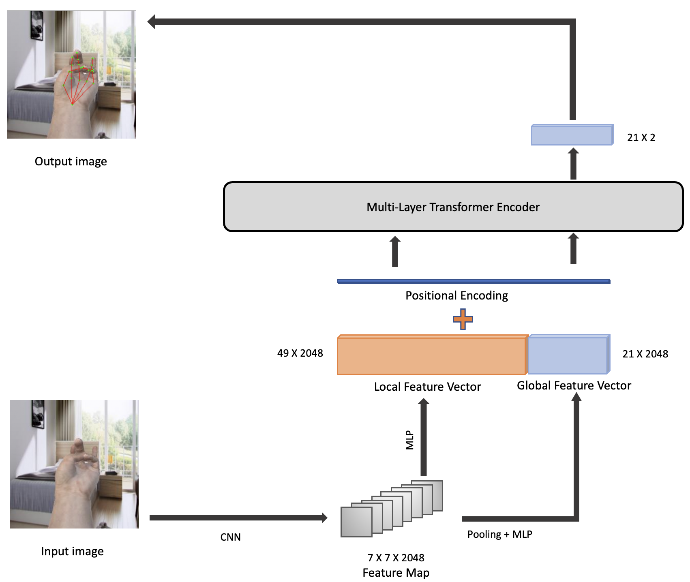
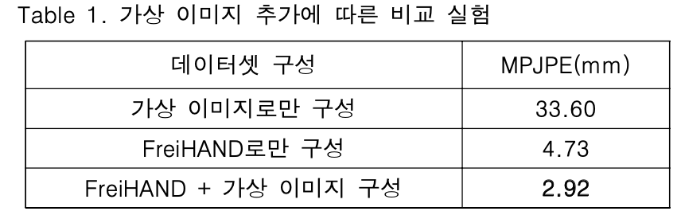
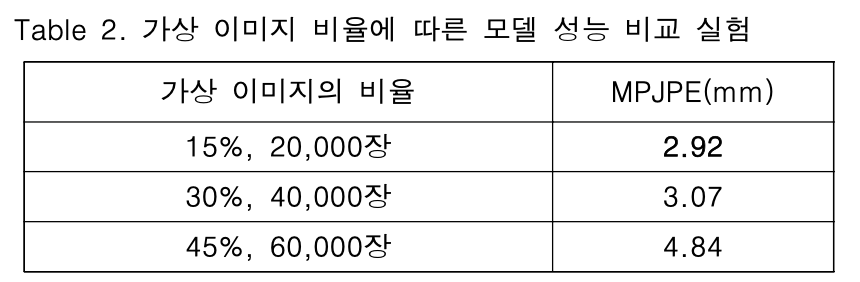
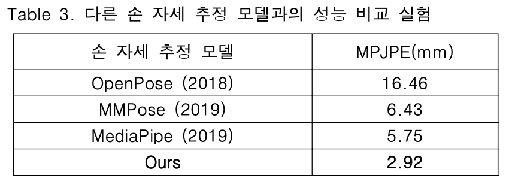
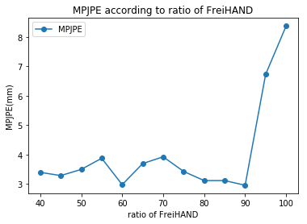

# Wearable_Pose_Model ✨✨


This is our research code of [Our_Model](docs/2022_KSCI.pdf). 

Our Model is a transformer-based method for hand pose from an input image. 
This image is obtained from wrist-attached RGB camera.
In this work, We study how to use our synthetic images.

  

## Installation(Download)
Build as the below architecture 
```
{$ROOT}
|-- build
|-- src
|-- datasets
|-- models
|-- docs
```

## Installation(Conda)
```bash
git clone https://github.com/leejeongho3214/Wearable_Pose_Model.git
cd Wearable_Pose_Model
conda env create -f requirements.yaml
```

## Model Download
Please download our files that are important to run our code. [download](https://dkuniv-my.sharepoint.com/:f:/g/personal/72210297_dankook_ac_kr/Em6dacaP1AlNmTAmaBbX2osBxkTx8km8k7BeHT2d-TWF5A?e=poqt1A)

## Train
```
run 'src/tools/train.py'
```
## Solution
If it happens error message about path as "src/...", you can insert the below code.
```python
import sys
sys.path.append("/usr/your/path/Wearable_Pose_Model")
```

## Result
  
  
  

## Compare(ing)
### Full contidition
1st, 2nd column: images

3rd column: distance between g.t and prediction
|FreiHAND(real)|CISLAB(synthetic)|Total|MPJPE(mm)|
|:----------------:|:-----------------:|:------:|:------:|
|100,000|0| 100,000|5.02|
|110,000|0| 110,000|4.60|
|120,000|0| 120,000|4.71|
|110,000|10,000| 120,000|**2.35**|
|100,000|20,000|120,000| 2.75|
|120,000|5,000|125,000| 3.03|
|120,000|10,000| 130,000|2.77|
|120,000|20,000| 140,000|2.92|
|120,000|40,000|160,000|3.07 |
|120,000|60,000|180,000| 4.84|


### Some part of condition
Total images are 10,000 images

below number means ratio of dataset
stop to train when count is 50

|Frei|CIS|error|
|:--:|:--:|:--:|
|100|0|8.38|
|95|5|6.73|
|90|10|2.95|
|85|15|3.11|
|80|20|3.11|
|75|25|3.42|
|70|30|3.92|
|65|35|3.69|
|60|40|2.97|
|55|45|3.87|
|50|50|3.49|
|45|55|3.28|
|40|60|3.39|

### Visualize(Some part)

 

