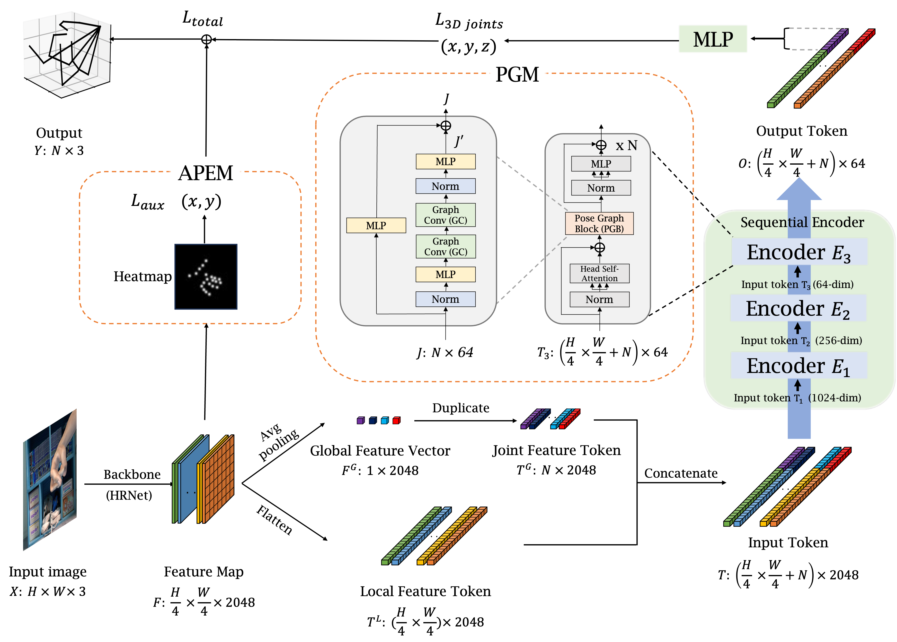

# SHaF: Synthetic Hand Dataset Including a Forearm (APIN 2023) ✨✨
It is a new hand image dataset called Synthetic Hand Dataset Including a Forearm (SHaF) and an efficient transformer-based three-dimensional (3D) hand pose estimation model. This model achieves the superior performance of the estimation model over that of previous state-of-the-art models.

  </br></br>

## Directory</br>
Build as the below architecture 
```
{$ROOT}
|-- build
|-- src
|-- datasets
|-- models
|-- docs
```

## Setup with Conda</br>
```bash
git clone https://github.com/leejeongho3214/Wearable_Pose_Model.git
cd Wearable_Pose_Model
conda env create -f requirements.yaml
```
</br>


## Model Download</br>
Please download our files that need to run our code. [download](https://dkuniv-my.sharepoint.com/:f:/g/personal/72210297_dankook_ac_kr/Em6dacaP1AlNmTAmaBbX2osBxkTx8km8k7BeHT2d-TWF5A?e=poqt1A)</br>
</br>


## Train</br>
If you locates in Wearabel_Pose_Model folder, run the code below and the training will begin
```
cd src/tools
python train.py
```
</br>

## Solution</br>
If you get a error message such as the wrong path, follow the code below
```python
import sys
sys.path.append("/usr/your/path/Wearable_Pose_Model")
```
</br>

## Result</br>
### Evaluation Metric
* PA-MPJPE
* AUC

